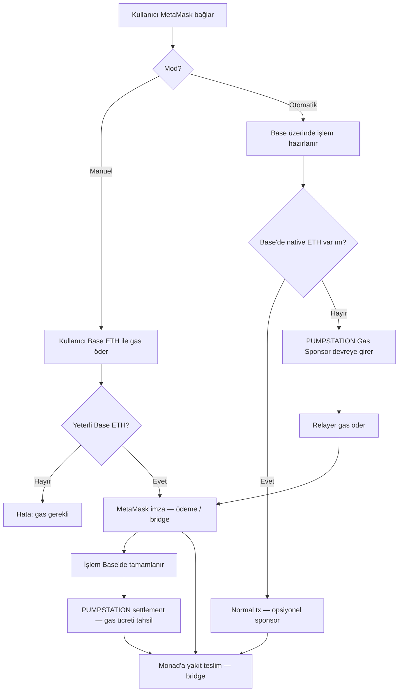

# PUMPSTATION Gas Yol Haritası

## Özet

Kullanıcıların **Base ağında ETH gas tutması zorunluluğunu kaldırırız**. MetaMask ile bağlanan kullanıcı, Base üzerinde işlem yaparken gas yoksa **PUMPSTATION otomatik gas verir**; işlem bitince ücret **otomatik tahsil edilir**.

---

## Beyin Haritası (Akış)



---

## Katman Mimarisi

| Katman | Dosya | Görev |
|--------|-------|-------|
| **UI** | `GasModeToggle.tsx`, `GasPumpWidget.tsx`, `PaymasterPoolBadge.tsx` | Mod seçimi, havuz bakiyesi |
| **State** | `GasModeProvider.tsx`, `useGasMode.ts` | Mod tercihi (localStorage) |
| **Orchestration** | `useGasPump.ts` | Pump akışı, toast, mod dallanması |
| **Gas Sponsor** | `lib/gas-sponsor.ts` | Eligibility, sponsor isteği, settlement |
| **On-chain** | `contracts/PumpPaymaster.sol`, `lib/paymaster-pool.ts` | ERC-4337 havuz + `addLiquidity` |
| **PUMPSTATION SDK** | `lib/pumpstation-client.ts`, `@pumpstation/gas-engine` stub | API / SDK sınırı |
| **Chain** | `lib/chains.ts`, `lib/wagmi.ts` | Base (8453) / Base Sepolia (84532) |
| **Risk** | `useWalletRisk.ts` | Bakiye + havuz; otomatik modda gas engeli yok |

---

## Manuel vs Otomatik

### Manuel Mod
1. Kullanıcı MetaMask'ta **Base** ağına geçer.
2. Ödeme + **gas** için yeterli Base ETH gerekir.
3. Tx doğrudan cüzdandan gönderilir; PUMPSTATION gas vermez.

### Otomatik Mod (PUMPSTATION)
1. Kullanıcı MetaMask ile imzalar (ETH başka ağda olabilir — PUMPSTATION route).
2. Uygulama Base native bakiyesini kontrol eder.
3. **Gas yoksa** → `requestGasSponsorship()` → relayer gas öder.
4. İşlem tamamlanınca → `settleGasSponsorship()` → ücret paket ödemesinden / settlement'tan kesilir.

---

## Kod Haritası

```
src/
├── types/gas-mode.ts
├── providers/GasModeProvider.tsx
├── lib/
│   ├── gas-sponsor.ts
│   └── pumpstation-client.ts
├── hooks/useGasPump.ts
packages/gas-engine-stub/            # @pumpstation/gas-engine
```

---

## PumpPaymaster (güncel sözleşme)

| Mod | On-chain | UI |
|-----|----------|-----|
| **Admin** | `adminAddNativeLiquidity` / `adminAddTokenLiquidity` | GAS HAVUZU → Admin sekmesi |
| **Manuel** | `buyGasManuel` — USDC öde, ETH gas al | GAS HAVUZU → Manuel |
| **Otomatik** | `validatePaymasterUserOp` + `postOp` (%0.5 fee) | Approve + Relayer UserOp |

## Üretim Checklist

- [x] `PumpPaymaster.sol` kaynak kodu
- [ ] Contract deploy + adres env'e
- [ ] `@pumpstation/gas-engine` gerçek paketi
- [ ] Base mainnet (8453) RPC + paymaster contract
- [ ] Settlement: işlem receipt sonrası otomatik tahsil
