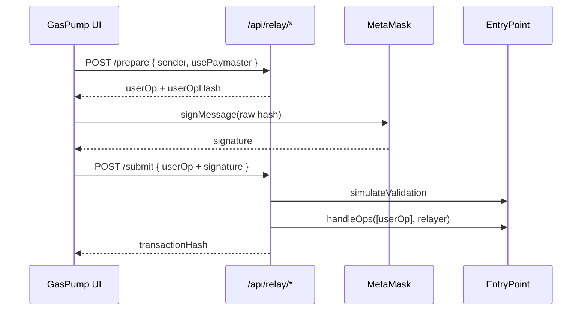

# PumpRelayer (Bundler / Aracı)

Kullanıcı cüzdanda **UserOperation hash**'ini imzaladıktan sonra relayer `EntryPoint.handleOps` ile işlemi ağa basar.

## Akış



## API

| Endpoint | Görev |
|----------|--------|
| `GET /api/relay/status` | Relayer yapılandırıldı mı? |
| `POST /api/relay/prepare` | Unsigned UserOp + hash |
| `POST /api/relay/submit` | İmzalı UserOp → `handleOps` |

## Sunucu env (`.env.local`)

```env
RELAYER_PRIVATE_KEY=0x...
BASE_RPC_PRIVATE_URL=https://sepolia.base.org
ENTRY_POINT_ADDRESS=0x5FF137D4b0FDCD49DcA30c7CF57E578a026d2789
NEXT_PUBLIC_PUMP_PAYMASTER_ADDRESS=0x...
```

## Kod

- `src/server/relayer/pump-relayer.ts` — `PumpRelayer` (ethers v6)
- `src/hooks/usePumpRelay.ts` — prepare → imza → submit
- `src/hooks/useGasPump.ts` — relayer açıksa mock yerine gerçek UserOp

## Önemli notlar

1. **sender** bir ERC-4337 **smart account** adresi olmalıdır (düz EOA çalışmaz).
2. İlk deploy için `initCode` ile `prepare` isteğine factory bytecode eklenebilir.
3. Üretimde Pimlico/Alchemy bundler veya kendi relayer node'unuz kullanılabilir; bu API aynı arayüzü korur.
